# 第八章高性能服务器程序框架

## 服务器模型

### C/S模型

程序逻辑：服务器创建多个socket，并监听socket，客户端连接空闲socket，通过socket进行通信。

因为客户端的连接是随机的，所有采取I/O复用技术来提高处理效率

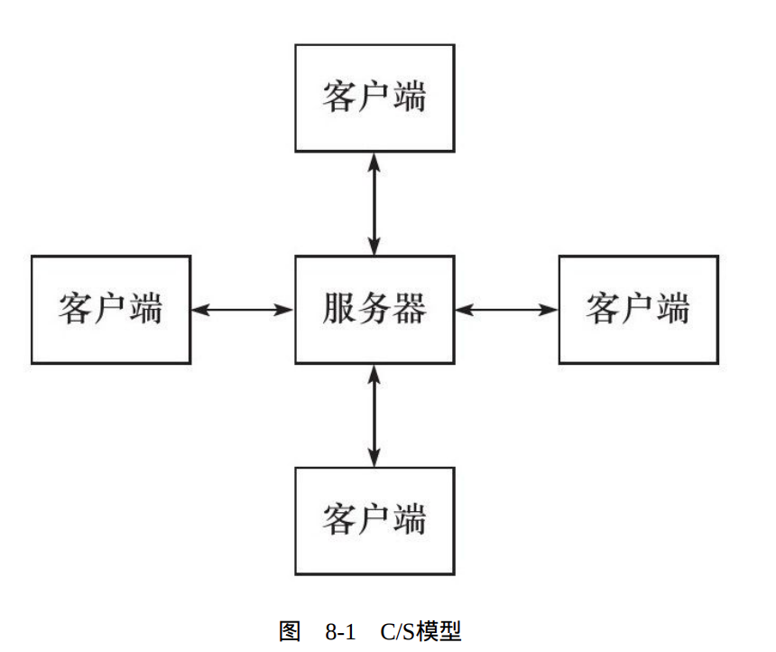

使用socket实现C/S模型

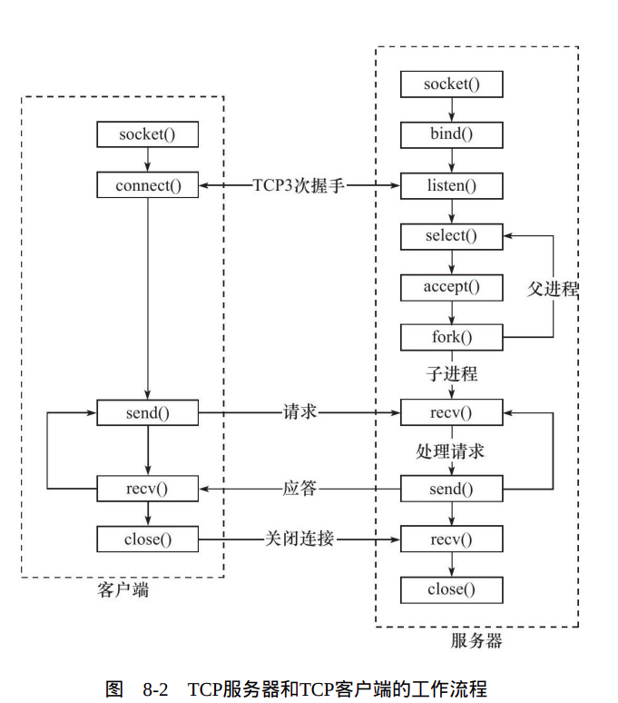

C/S模型适合资源相对集中的场合，其缺点也很明显：服务器是通信的中心，当访问量过大时，可能所有客户都将得到很慢的响应。

### P2P模型

P2P模型，每个用户的客户端也是服务端。

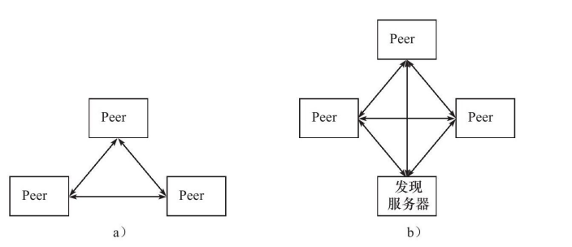

P2P模型可以看作C/S模型的扩展：每台主机既是客户端，又是服务器。因此，我们仍然采用C/S模型来讨论网络编程。

## 服务器编程框架

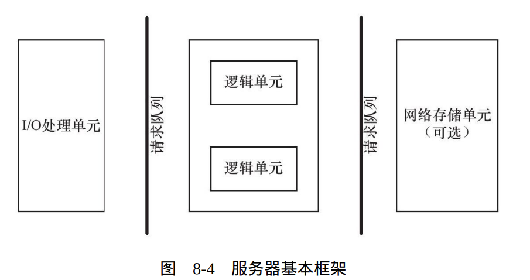

一般服务器框架都有以上三个部分组成。

1. I/O处理单元是服务器管理客户连接的模块。
2. 一个逻辑单元通常是一个进程或线程。
3. 网络存储单元可以是数据库、缓存和文件，甚至是一台独立的服务器。
4. 请求队列是各单元之间的通信方式的抽象。请求队列通常被实现为池的一部分，就相当于在池中选取满足条件的某样东西，如进程池，线程池等。优点：不用反复创建，避免额外的创建销毁成本。

## I/O模型

阻塞IO：因为某种原因，系统无法立即完成IO上的某个任务，那该任务就挂在队列（不一定是队列）中等待，直到完成。

非阻塞IO：无论任务或事件是否执行，它会立即交给系统，立即返回。当事件或任务没有立即发生，系统调用返回-1与报错一样，设置errno。非阻塞I/O通常要和其他I/O通知机制一起使用，比如I/O复用和SIGIO信号。

**I/O复用**是最常使用的**I/O通知机制**。它指的是，应用程序通过I/O复用函数**向内核注册一组事件**，内核通过I/O复用函数把**其中就绪的事件通知给应用程序**。理解为，请内核作一个监管者，将一组事件进行监管，达到要求，就告诉程序，让程序来拿。

SIGIO信号也可以用来报告I/O事件。阻塞I/O、I/O复用和信号驱动I/O都是**同步I/O模型**

> [!TIP]
>
> 通义千问给的参考：
>
> 同步IO指的是当一个进程发起IO请求后，必须等待该IO操作完成才能继续执行后续代码的模式。在这个过程中，进程会被阻塞，直到IO操作结束并返回结果。
>
> 异步IO是指进程发起IO请求之后不立即阻塞等待结果，而是继续执行后续代码。当IO操作完成后，系统会通知进程，或者由进程轮询检查IO是否完成。

同步IO：在这三种I/O模型中，I/O的读写操作，都是在I/O事件发生之后，由应用程序来完成的

异步IO：用户可以直接对I/O执行读写操作，程序并未阻塞，等待IO完成通知程序即可。

<imgsrc="./assets/image-20250109161659106.png"alt="image-20250109161659106"/>

## 两种高效的事件处理模式

两种高效的事件处理模式：**Reactor和Proactor**

### Reactor模型

Reactor模式将程序分为主线程和工作线程，主线程只赋值监听事件是否发生。工作线程负责处理事件，也包括通信连接。Reactor一般采取同步IO

工作流程：

1. 主线程往epoll内核事件表中注册socket上的读就绪事件。
2. 主线程调用epoll_wait等待socket上有数据可读。
3. 当socket上有数据可读时，epoll_wait通知主线程。主线程则将socket可读事件放入请求队列。
4. 睡眠在请求队列上的某个工作线程被唤醒，它从socket读取数据，并处理客户请求，然后往epoll内核事件表中注册该socket上的写就绪事件。
5. 主线程调用epoll_wait等待socket可写。
6. 当socket可写时，epoll_wait通知主线程。主线程将socket可写事件放入请求队列。
7. 睡眠在请求队列上的某个工作线程被唤醒，它往socket上写入服务器处理客户请求的结果

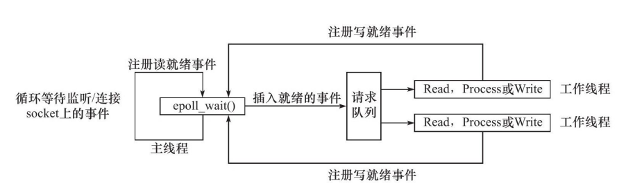

### Proactor模式

该模式与Reactor区别：工作线程只负责具体业务，其余交给主线程。Proactor一般采用异步IO。

工作流程是：

1. 主线程调用aio_read函数向内核注册socket上的读完成事件，并告诉内核用户读缓冲区的位置，以及读操作完成时如何通知应用程序（这里以信号为例，详情请参考sigevent的man手册）。
2. 主线程继续处理其他逻辑。
3. 当socket上的数据被读入用户缓冲区后，内核将向应用程序发送一个信号，以通知应用程序数据已经可用。
4. 应用程序预先定义好的信号处理函数选择一个工作线程来处理客户请求。工作线程处理完客户请求之后，调用aio_write函数向内核注册socket上的写完成事件，并告诉内核用户写缓冲区的位置，以及写操作完成时如何通知应用程序（仍然以信号为例）。
5. 主线程继续处理其他逻辑。
6. 当用户缓冲区的数据被写入socket之后，内核将向应用程序发送一个信号，以通知应用程序数据已经发送完毕。
7. 应用程序预先定义好的信号处理函数选择一个工作线程来做善后处理，比如决定是否关闭socket。

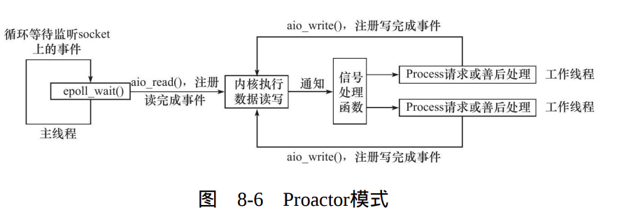

### 同步IO模拟Proactor模式

其原理是：主线程执行数据读写操作，读写完成之后，主线程向工作线程通知这一“完成事件”。

工作流程如下：

1. 主线程往epoll内核事件表中注册socket上的读就绪事件。
2. 主线程调用epoll_wait等待socket上有数据可读。
3. 当socket上有数据可读时，epoll_wait通知主线程。主线程从socket循环读取数据，直到没有更多数据可读，然后将读取到的数据封装成一个请求对象并插入请求队列。
4. 睡眠在请求队列上的某个工作线程被唤醒，它获得请求对象并处理客户请求，然后往epoll内核事件表中注册socket上的写就绪事件。
5. 主线程调用epoll_wait等待socket可写。
6. 当socket可写时，epoll_wait通知主线程。主线程往socket上写入服务器处理客户请求的结果。

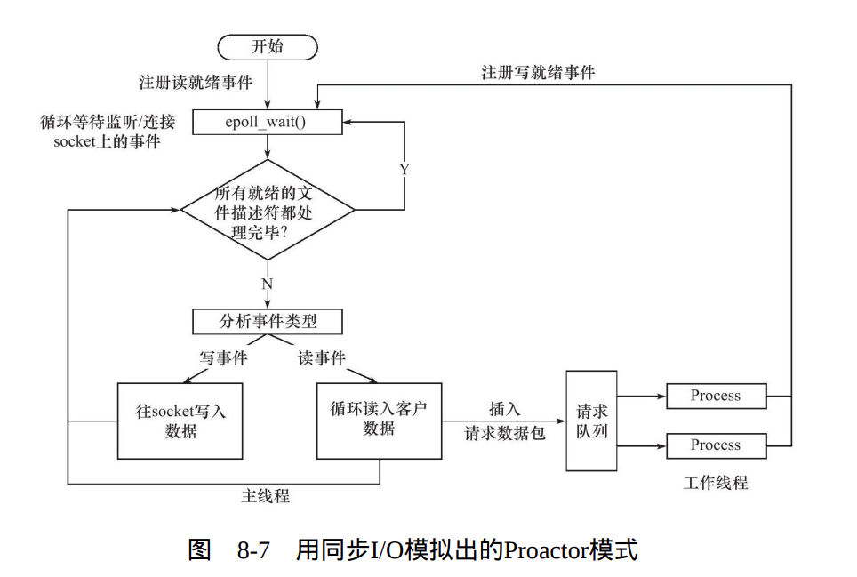

## 两种高效的并发模式

并发模式适合IO密集型的工作，对于计算密集型的工作，效率不高。

### 半同步/半异步模式

在并发模式中，“同步”指的是程序完全按照代码序列的顺序执行；“异步”指的是程序的执行需要由系统事件（中断、信号等）来驱动。

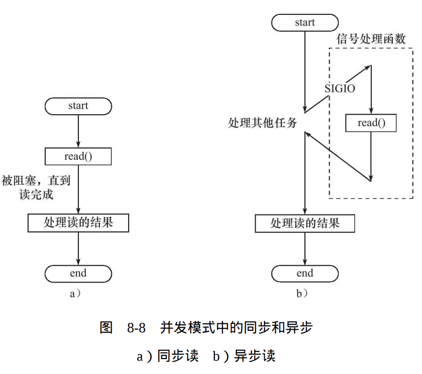

| 名称 | 同步线程             | 异步线程                 |
| ---- | -------------------- | ------------------------ |
| 优点 | 逻辑简单，便于实现   | 执行效率高，实时性强     |
| 缺点 | 效率较低，实时性较差 | 编程复杂，不宜拓展和调试 |

半同步/半异步：同时用同步线程和异步线程，分别处理不同的工作。

在服务器程序中，同步线程用于处理客户逻辑，异步线程用于处理I/O事件。

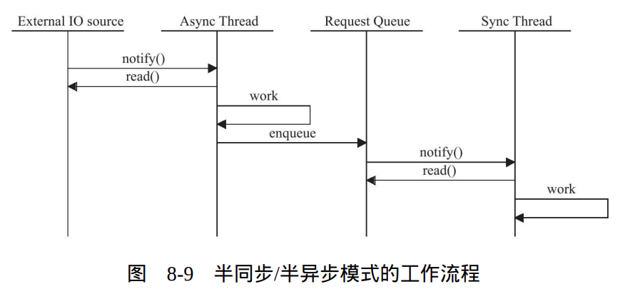

半同步/半异步的变态模式：半同步/半反应堆模式

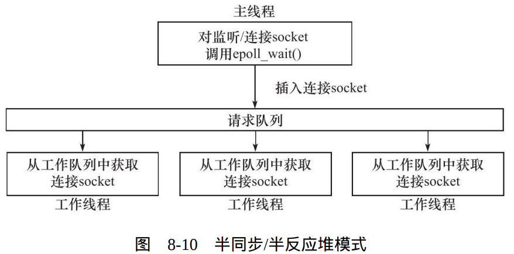

半反应堆：可以用Reactor模式也可以用Proactor模式。

缺点：

1. 队列需要加锁，有额外开销
2. 工作线程只能处理一个客户请求，容易出现事件堆积现象，导致客户响应变慢。

#### 高效的半同步/半异步模式

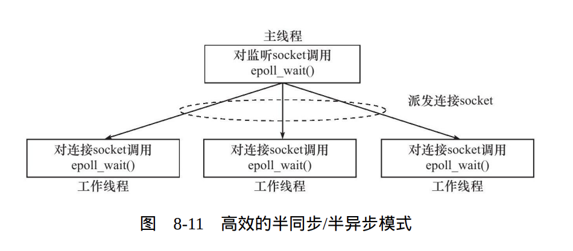

主线程只管理监听socket，连接socket由工作线程来管理。每个工作线程有自己的事件队列，它们各自独立监听不同的事件和socket。

### 领导者/追随者模式

领导者/追随者模式是多个工作线程轮流获得事件源集合，轮流监听、分发并处理事件的一种模式。程序都仅有一个领 导者线程，它负责监听I/O事件，追随者负责处理事件。

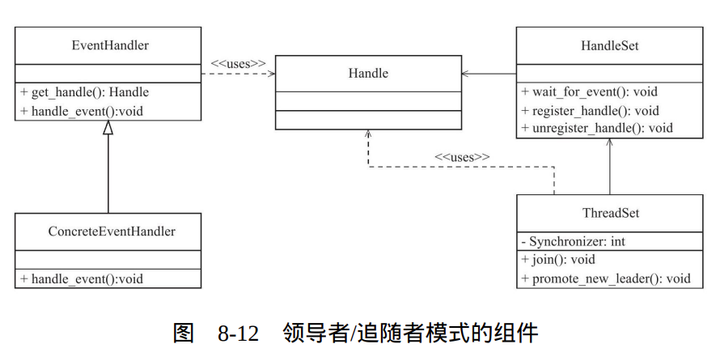

句柄（Handle）用于表示I/O资源，线程集是所有工作线程（包括领导者线程和追随者线程）的管理者。

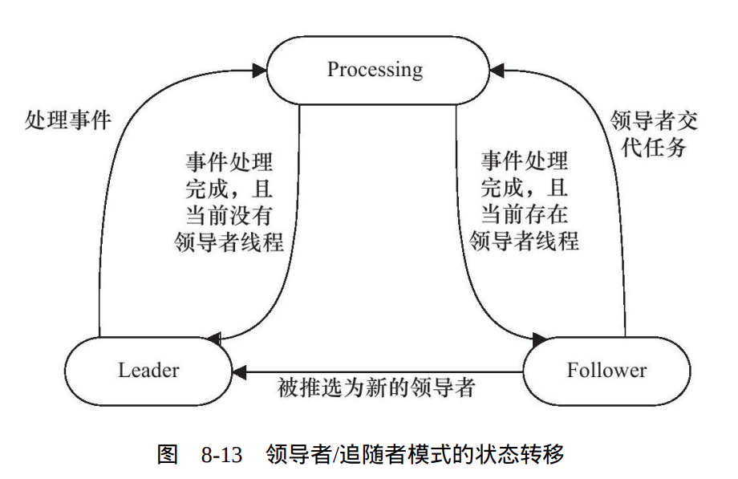

事件处理器通常包含一个或多个回调函数handle_event。这些回调 函数用于处理事件对应的业务逻辑。

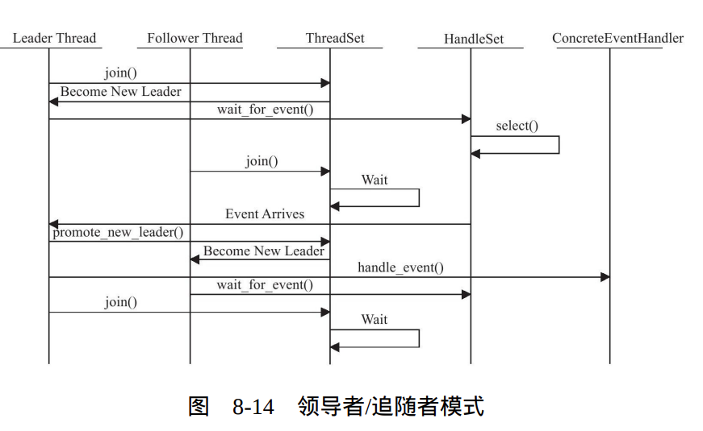

## 有限状态机

有限状态机是一种高效编程方法。

## 提高服务器性能的其他建议

### 池

### 数据复制

### 上下文切换和锁

