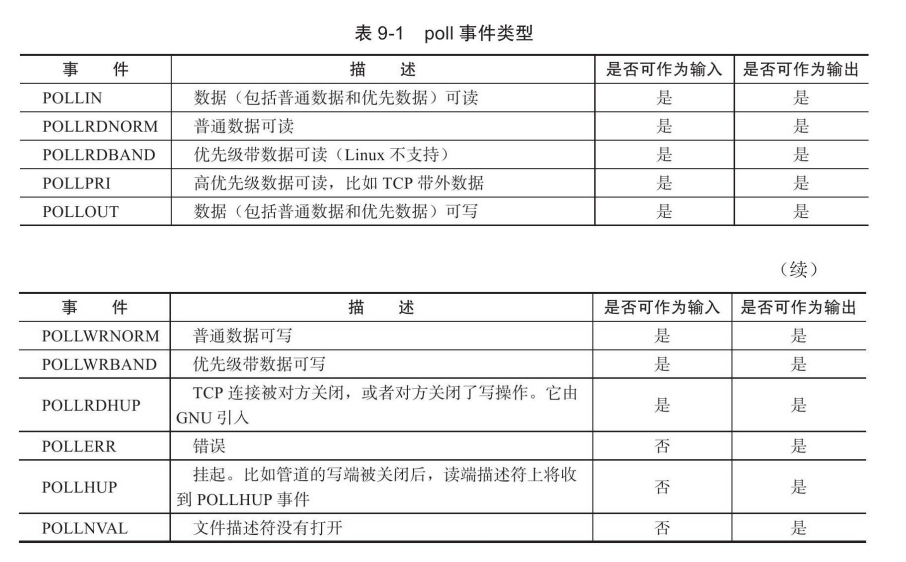
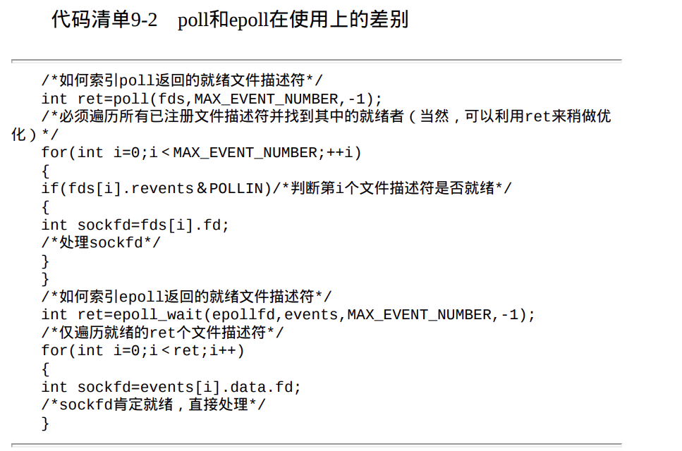
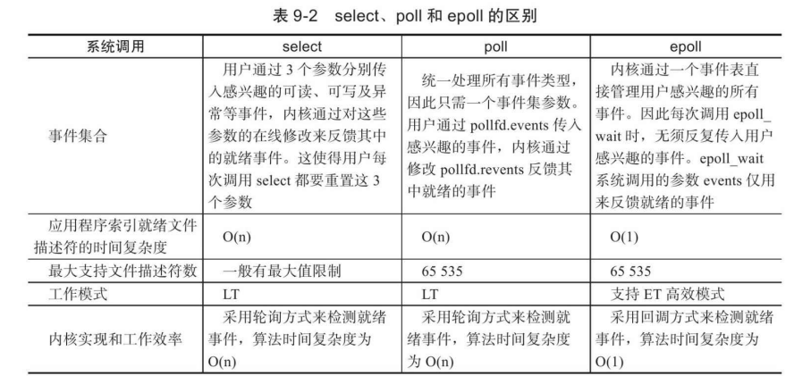

# I/O复用

I/O复用使得程序能同时监听多个文件描述符，这对提高程序的性能至关重要。

## select系统调用

select系统调用的用途是：在一段指定时间内，监听用户感兴趣的文件描述符上的可读、可写和异常等事件。

### selectAPI

```c++
#include<sys/select.h>
int select(int nfds,fd_set* readfds,fd_set *writefds,
			fd_set *exceptfds,struct timeval* timeout);
/*
	nfds:制定被监听的文件描述符的总数，从0开始
	readfds、writefds和exceptfds参数分别指向可读、可写和异常等事件对应的文件描述符集合。
	timeout参数用来设置select函数的超时时间。
*/

#include＜typesizes.h＞
#define__FD_SETSIZE 1024
#include＜sys/select.h＞
#define FD_SETSIZE__FD_SETSIZE
typedef long int __fd_mask;
#undef__NFDBITS
#define__NFDBITS(8*(int)sizeof(__fd_mask))
// fd_set类型，long int，每个元素的每一位标记一个文件描述符。
typedef struct
{
#ifdef__USE_XOPEN
__fd_mask fds_bits[__FD_SETSIZE/__NFDBITS];
#define__FDS_BITS(set)((set)-＞fds_bits)
#else
__fd_mask__fds_bits[__FD_SETSIZE/__NFDBITS];
#define__FDS_BITS(set)((set)-＞__fds_bits)
#endif
}fd_set;

//用于处理fd_set的宏
#include＜sys/select.h＞
FD_ZERO(fd_set*fdset);/*清除fdset的所有位*/
FD_SET(int fd,fd_set*fdset);/*设置fdset的位fd*/
FD_CLR(int fd,fd_set*fdset);/*清除fdset的位fd*/
int FD_ISSET(int fd,fd_set*fdset);/*测试fdset的位fd是否被设置*/


//timeval结构体内容
struct timeval
{
long tv_sec;/*秒数*/
long tv_usec;/*微秒数*/
};
```

给timeout变量的tv_sec成员和tv_usec成员都传递0，则select将立即返回。如果给timeout传递NULL，则select将一直阻塞。

select成功时返回就绪（可读、可写和异常）文件描述符的总数。 如果在超时时间内没有任何文件描述符就绪，select将返回0。select失败时返回-1并设置errno。如果在select等待期间，程序接收到信号，则select立即返回-1，并设置errno为EINTR。

### 文件描述符的就绪条件

**socket可读条件：**

1. **socket内核接收缓存区**中的字节数大于或等于其低水位标记SO_RCVLOWAT。此时我们可以无阻塞地读该socket，并且读操作返回的字节数大于0。
2. socket通信的对方关闭连接。此时对该socket的读操作将返回0。
3. 监听socket上有新的连接请求。
4. socket上有未处理的错误。此时我们可以使用getsockopt来读取和清除该错误。

**socket可写条件**：

1. **socket内核发送缓存区**中的可用字节数大于或等于其低水位标记SO_SNDLOWAT。此时我们可以无阻塞地写该socket，并且写操作返回的字节数大于0。
2. socket的写操作被关闭。对写操作被关闭的socket执行写操作将触发一个SIGPIPE信号。
3. socket使用非阻塞connect连接成功或者失败（超时）之后。
4. socket上有未处理的错误。此时我们可以使用getsockopt来读取和清除该错误。

## Poll系统调用

```c++
#include＜poll.h＞
intpoll(struct pollfd*fds,nfds_t nfds,int timeout);
/*
	fds参数是一个pollfd结构类型的数组
	nfds：制定为被监听事件集合fds的大小
*/
typedef unsigned long int nfds_t;
struct pollfd
{
	int fd;/*文件描述符*/
	short events;/*注册的事件*/
	short revents;/*实际发生的事件，由内核填充*/
};
```



## epoll系列系统调用

epoll使用一组函数来完成任务，而不是单个函数。

epoll把用户关心的文件描述符上的事件放在内核里的**一个事件**表中，从而无须像select和poll那样每次调用都要重复传入文件描述符集或事件集。但epoll需要使用**一个额外的文件描述符**，来唯一标识内核中的这个事件表。

```c++
#include＜sys/epoll.h＞
//返回文件描述符，是作为epoll系列函数的第一个参数epfd。
int epoll_create(int size); // size只是一个提示，事件表需要多大
```

```C++
int epoll_ctl(int epfd,int op,int fd,struct epoll_event*event);
/*
	用于操作epoll内核事件表
	fd:需要操作的文件描述符
	op：操作类型
		EPOLL_CTL_ADD，往事件表中注册fd上的事件。
		EPOLL_CTL_MOD，修改fd上的注册事件。
		EPOLL_CTL_DEL，删除fd上的注册事件。
	event：事件
	epoll_ctl成功时返回0，失败则返回-1并设置errno。
*/

struct epoll_event
{
	__uint32_t events;/*epoll事件,events成员描述事件类型*/
	epoll_data_t data;/*用户数据*/
};
typedef union epoll_data
{
    void*ptr;
	int fd;
    uint32_t u32;
	uint64_t u64;
}epoll_data_t;
```

```C++
#include＜sys/epoll.h＞
int epoll_wait(int epfd,struct epoll_event*events,
               int maxevents,int timeout);
/*
	它在一段超时时间内等待一组文件描述符上的事件
	该函数成功时返回就绪的文件描述符的个数，失败时返回-1并设置errno。
	maxevents:指定最多监听多少个事件，它必须大于0
	
	epoll_wait函数如果检测到事件，就将所有就绪的事件从内核事件表（由epfd参数指定）中复制到它的第二个参数events指向的数组中。
*/
```

**select/Poll与epoll的差别**



### LT模式与ET模式

epoll对文件描述符的操作有两种模式：LT（LevelTrigger，电平触发）和ET（EdgeTrigger，边沿触发）。LT模式是默认的工作模式。

LT模式：当epoll检查有事件发生，通知程序，程序可以选择不处理和处理。当未处理时，epoll会在下次epoll_wait被调用时再次提醒程序，直到程序处理该事件。

ET模式：当epoll_wait检测事件发生，通知程序，程序立马执行，即不会再通知程序。

### EPOLLONESHOT事件

**问题**：我们使用ET模式，一个socket上的某个事件还是可能被触发多次。这在并发程序中就会引起一个问题。比如一个线程（或进程，下同）在读取完某个socket上的数据后开始处理这些数据，而在数据的处理过程中该socket上又有新数据可读（EPOLLIN再次被触发），此时另外一个线程被唤醒来读取这些新的数据。于是就出现了两个线程同时操作一个socket的局面。

解决方法：使用EPOLLONESHOT事件

注册了EPOLLONESHOT事件的文件描述符，操作系统最多 触发其上注册的一个可读、可写或者异常事件，且只触发一次。

## I/O复用系统调用对比



## I/O复用的高级应用一：非阻塞connect

欠缺，待研究中.........

## I/O复用的高级应用二：聊天室程序

代码学习

## I/O复用的高级应用三：同时处理TCP和UDP 服务

待学习。。。

## 超级服务Xinetd

待学习。。。